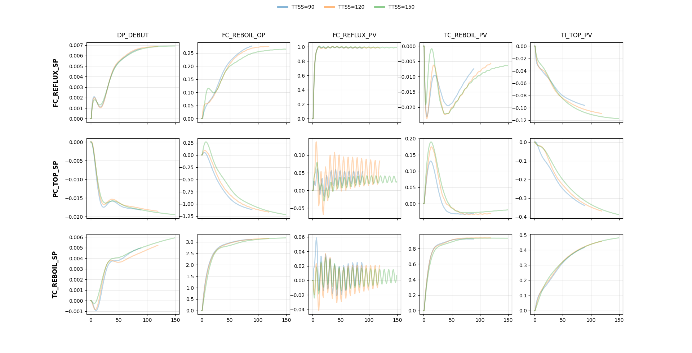
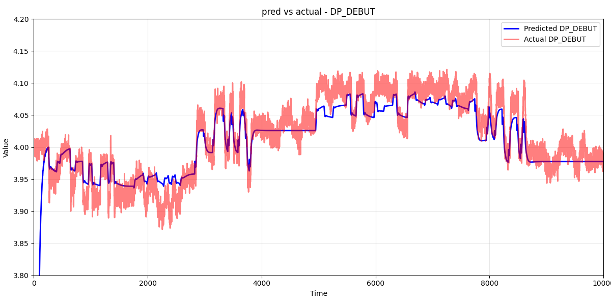
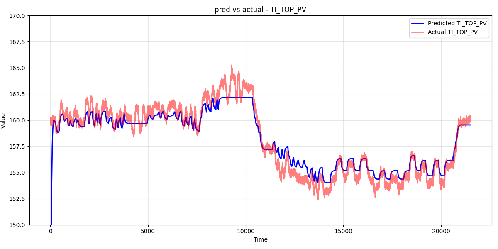

# Subspace Identification

## Purpose

The purpose of this application is to identify refinery plant / chemical plant dynamics using a multiple input
multiple output model. N4SID is used for this *(Numerical Algorithms for Subspace State Space System Identification)*.

 - Import vectors (fake data)
 - Run the case
 - Models are identified
 - Run predictions

## Program Run Example
**Import the vector data**. Fake data is supplied for testing the program:

**Run a model**, gain relationships are displayed (per 1 unit change in input):

**Run predictions**. 

## Future Work

 - Scale gain relationships by input sizes set by user
 - Add option to apply a simple first order exponential filter to outputs before running the analysis
 - Add lineariziation option for inputs / outputs
 - Checkbox style is clunky for setting up model runs, need to change this
 - Want to save case results so they do not need to be re-ran when opening program

